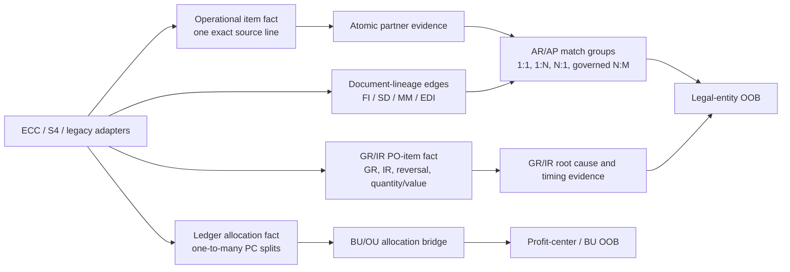

# SAP intercompany AR/AP and GR/IR SQL review

Reviewed source: `ic sql code.txt` (683 lines). The original file was not modified.

Review date: 2026-09-03

## Executive verdict

**NOT READY for production out-of-balance reporting or a financial control.** It is a useful exploratory prototype, but it is not yet an AR-to-AP matcher and it is not a true GR/IR three-way match. The query currently:

1. extracts AR, AP, selected G/L accruals, and GR/IR;
2. assigns one BU/OU to each accounting amount;
3. translates the amounts to USD;
4. nets unrelated records sharing the same unordered BU-pair string.

It does not construct reciprocal transaction groups using invoice/reference/PO-item evidence. Unrelated items can offset each other, split-profit-center amounts can be assigned to the wrong BU, and some joins can multiply or suppress monetary rows.

The most important design correction is to keep four separate facts:

- one exact operational AR/AP/G/L item fact;
- one-to-many ledger/profit-center allocation rows;
- many-to-many AR/AP match-group membership;
- a separate GR/IR PO-item exception fact.

Match legal entities and obligations first. Apply BU/OU allocation afterward. Attach GR/IR only when it has causal transaction lineage to a specific unmatched AR/AP obligation.

## Stop-ship findings

| Priority | Lines | Finding | Financial risk | Required correction |
|---|---:|---|---|---|
| P0 | 94-113, 290; 543-558 | AR is labeled `10250000` but never filtered to that account. | Every customer item with a nonblank `VBUND` can be mislabeled and included. | Filter through a governed IC-account registry or retain actual `HKONT`; never hardcode the output label independently. |
| P0 | 94-110, 237-246; 543-557, 590-604 | `MANDT` and `BUZEI` are absent from AR/AP item identity. The AR anti-join is document-level. | One cleared customer line can suppress a different open line; equal-looking lines can collapse; clients can mix. | Carry `source_system + MANDT + BUKRS + GJAHR + BELNR + BUZEI` through every stage and use it in anti-joins. |
| P0 | 166; 568 | FI `BELNR` is joined directly to SD `VBRP-VBELN`. | Unrelated documents can collide and true billing links can be missed. | Join the accounting item to `VBRK` using client, company code, fiscal year, and `VBRK-BELNR`; then join `VBRP` by billing `VBELN`. Use `BKPF-AWTYP/AWKEY/AWSYS` as corroboration where available. |
| P0 | 60-68, 129-140, 172-176, 249-261; 495-503, 559-587, 618-629 | `MAX`, dominant-BU selection, and `ROW_NUMBER()=1` discard real profit-center splits. | A 40/60 split can become 100% assigned to one arbitrary BU. `MAX(BU)` and `MAX(OU)` can form a combination that never existed. | Build allocation child rows and enforce that allocated amounts sum to the exact source item. Use FAGLFLEXA/document-split data in ECC New GL or ACDOCA in S/4. |
| P0 | 113, 220, 240-246, 281 | The time scopes mix all open items, recently cleared items, recent manual G/L postings, and two years of GR/IR activity. | The result is neither a point-in-time balance nor a period movement report. Old open GR/IR/accruals can disappear while cleared activity remains. | Parameterize one `as_of_date`; use posting on/before the date and clearing after the date/initial for a snapshot. Build period movement separately. |
| P0 | 458-482; 660-682 | No AR/AP transaction pairing occurs. Netting is only by unordered BU pair. | Unrelated invoices, payments, currencies, companies, and years can offset and appear balanced. | Match directed legal-entity pairs in transaction currency using governed evidence and explicit 1:1/1:N/N:1/N:M match groups. Aggregate by BU only after matching and allocation. |
| P0 | 207-230, 380-420, 459-479 | GR/IR is summed into AR+AP without PO-item lineage. | Two independent exceptions can falsely net to zero and be called `TIMING_EXPLAINED`. | Build GR/IR at `buyer + PO + item + account assignment + account + currency`; use it as a sidecar. Only a linked buyer GR/IR credit can causally explain seller AR with missing buyer AP. |
| P0 | 78-89, 122-126, 166-168, 185-193, 337-338, 414, 418 | Several joins are one-to-many or omit client/company constraints. | Monetary rows can be duplicated after the current ranking step. | Assert cardinality before/after each enrichment; pre-aggregate to unique keys or retain explicit allocation rows. |

P0 means the query can return a materially wrong balance, attribution, or classification—not merely incomplete descriptive metadata.

## Line-by-line risk register

This table covers each logical block of both scripts. Line numbers refer to the supplied text file.

| Lines | Severity | Review |
|---:|:---:|---|
| 1-8 | P1 | `%sql` is notebook syntax, not part of a `Value.NativeQuery` string. `current_date()` makes reruns nonreproducible. The top comment also excludes accruals from its stated OOB definition, while line 461 includes them. |
| 12-16 | P1 | `T001-RCOMP` is the right SAP company/trading-partner bridge, but one company can contain multiple company codes. Converting that valid one-to-many relationship to `NULL` misclassifies local partners. Missing `MANDT`, source system, effective dates, and CDC-state resolution. Independent `MIN(BUTXT)`/`MIN(LAND1)` values are not an authoritative company record. |
| 18-23 | P1 | `KNA1` is customer master, not a canonical company-name table. `MIN(NAME1)`/`MIN(LAND1)` can come from different customer rows. Current master data is not guaranteed to represent the partner at the historical posting date. |
| 25-31 | P1 | `active_ar_entities` tests only whether a company has any AR anywhere in retained data. It does not test reciprocal AP visibility, account scope, period, source/client completeness, or entity-map coverage. Using it for AP, G/L, and GR/IR creates misleading `MATCHABLE/ONE_SIDED` statuses. |
| 33-47 | P1 | The rate-type fallback is global by currency pair: one CPM row suppresses all 1001 dates, including CPM gaps. `DOUBLE` introduces avoidable rounding. Exact duplicate rates are not deterministically resolved. |
| 49-55 | P1 | `forex_overlap_check` is never consumed and therefore asserts nothing. The overlap condition also misses intervals touching at an inclusive boundary; all downstream joins use both endpoints inclusively. |
| 56-58 | P1 | BU/OU data is not source-, client-, or effective-date scoped. Ensure one governed version of the organization hierarchy per reporting date. |
| 59-68 | P0 | “Dominant BU” is based on count of mapping rows, not transaction ownership or value. It fabricates a BU for multi-BU companies. Only a genuinely unique company-to-BU mapping is safe as a fallback; otherwise use `UNALLOCATED`. |
| 70-72 | P0 | `VBUND` is later compared directly to `OU`. In SAP, `VBUND/RASSC` is a trading-partner company ID, not a BU or OU. Code equality can only be an explicitly governed local convention. |
| 75-80 | P1 | EKKO/EKPO join omits `MANDT`. Profit-center mapping omits company/controlling area/effective date. `po_single_ou` later drops PO item and client. Profile whether `KO_PRCTR` is the intended landed field and whether multiple account assignment requires `EKKN/ZEKKN`. |
| 81-90 | P1 | VBAK/VBAP/KNA1 joins omit `MANDT`. The KNA1 join is unused and can remove or multiply sales orders. Profit center maps on code alone. `VBAK-BSTNK` is aliased as both header and “line-item” PO reference, though it remains header-level. |
| 91-114 | P0 | AR has no account filter, omits `MANDT/BUZEI`, performs a document-level open/cleared anti-join, and mixes balance with clearing history. Initial values are not comprehensively normalized. |
| 115-127 | P1 | Profit-center and transfer mappings are not effective-dated; `profit_ctr_xfer_ou` drops company/controlling area, making reused profit-center codes ambiguous. |
| 129-140 | P0 | The entire accounting document is reduced to independent `MAX(OU)` and `MAX(BU)` values. The join to AR can multiply BSEG before aggregation when several AR items exist. Cost-center-prefix derivation is custom, not SAP standard, and blank PRCTR values do not activate the `IS NULL` fallback. |
| 142-171 | P0 | Incorrect FI-to-SD key, missing clients, scalar `MAX` subqueries, and multi-item billing fanout. The full AR amount is copied to every joined VBRP row before later discarding all but one. |
| 172-176 | P0 | The partition is not the SAP item key and the order is nondeterministic when billing lines share one billing document. It hides fanout instead of allocating or resolving it. |
| 178-183 | P1 | `unique_ou_per_bu` is acceptable only as a separately labeled deterministic mapping. `po_single_ou` groups by PO header alone, so distinct clients, companies, and items can be combined. |
| 185-193 | P0 | `DISTINCT` still permits multiple rows per sales order because item category is selected. The later join uses SO only and occurs after AR ranking, so it can duplicate the selected AR amount. The custom order/item categories need a governed configuration table, not hardcoded logic. |
| 196-205 | P1 | Hardcoded substitutions have no validity period, approver, source-system scope, or reason. Treat them as governed data, not SQL code. |
| 207-221 | P0 | GR/IR omits `BUZEI`, `EBELN`, `EBELP`, account-assignment number, event type, movement type, quantities, and reversal handling. It selects a two-year activity window, not open items at a key date. `STBLG` is selected but unused. One hardcoded G/L account cannot be assumed complete across charts and company codes. |
| 222-230 | P0 | `MAX(document VBUND)` and `MAX(vendor-master VBUND)` are not atomic evidence. A normal goods-receipt FI document often lacks a vendor subledger line, so this path preferentially resolves invoice receipts and loses the GR side. LFA1 join omits client. |
| 235-247 | P0 | AP omits `MANDT/BUZEI` and source system, has no full-key open/cleared overlap control, and filters only a hardcoded account list. Special G/L behavior (`UMSKZ`) and account-map validity are not explicit. |
| 249-261 | P0 | `MAX(EBELN/OU/BU)` discards PO items and profit-center splits. The raw AP join can replicate every BSEG row once per AP item before aggregation. |
| 264-281 | P1 | These are G/L lines, not vendor AP items. Whether blank `AUGDT` means open depends on whether each G/L account is open-item managed. `Z1/ME` and the account list are enterprise configuration that public SAP documentation cannot validate. PRCTR is not retained, preventing granular allocation. |
| 287-340 | P0 | AR account is hardcoded; partner company ID is used as a BU fallback; several scalar `MAX` expressions choose arbitrary mappings; FX can fan out; split AR is reduced to one row. `bu_relationship` mixes legal and management identifier domains. |
| 344-376 | P0 | Same partner-domain, dominant-BU, FX, and line-key problems. `visibility_class` is based on the AR-only population. Every AP line is labeled `DIRECT` without evidence. |
| 380-420 | P0 | GR/IR BU and OU can be derived from different sources. Partner derivation drops unresolvable rows—exactly the population needing remediation. The `WHERE` clause removes non-partner GR/IR from diagnostic completeness. |
| 424-456 | P1 | Manual G/L entries are labeled AP accruals, assigned a company-default BU, and treated as direct flows. Nonblank VBUND is required, so missing-partner IC-account exceptions disappear. |
| 459-467 | P0 | The group key is only BU pair. `SUM` ignores null USD amounts, so missing FX can make a pair appear balanced. No company, currency, cutoff, obligation, or causal lineage is retained. |
| 469-482 | P0 | Pair totals are repeated on every detail row, inviting double counting in Power BI. `TIMING_EXPLAINED` tests only opposite sign and GR/IR magnitude ≥50%; a GR/IR balance ten times the OOB still passes. Near-zero AR/AP with huge GR/IR is called `BALANCED`. |
| 483-484 | P1 | Raw pipe separator plus another `%sql` means the full text file cannot execute as one native SQL query. Keep the scripts in separate files/cells and remove notebook magic before Power BI. |
| 490-538 | P1 | The NAFTA query repeats the hierarchy, dominant-BU, VBUND-to-OU, and FX defects. Geography is attached to BU hierarchy; validate whether LATAM inclusion under the name “NAFTA” is intentional. |
| 542-558 | P0 | Repeats the AR account, item-key, anti-join, and as-of defects. |
| 559-587 | P0 | Repeats the unsafe FI-to-SD join and reduces every billing/document split to a single BU. |
| 590-617 | P0 | Repeats AP item-key/population defects and mixes operational AP with G/L accrual movement. |
| 618-629 | P0 | Repeats document-level `MAX(BU)` allocation. |
| 633-659 | P1 | Missing FX becomes null and silently drops from amounts; partner code can be treated as a BU; no mapping or allocation residual is exposed. |
| 660-682 | P1 | This is aggregation, not pairing. Row counts are called document counts. Whole-dollar rounding can hide residuals, and `LIMIT 25` prevents complete drill-through if used as the semantic-model source. |
| 683 | P1 | Raw pipe separator is invalid SQL. |

## SAP fact-checks that materially change the design

### 1. Reconcile companies/trading partners before BU/OU

SAP defines `BSEG-VBUND` and ledger `RASSC` as the company ID of the trading partner, while profit center and partner profit center are separate fields. The present `OU = VBUND` comparison is therefore not standard SAP semantics. See [SAP direct line-item fields](https://help.sap.com/saphelp_scm700_ehp02/helpdata/en/67/ad8953b97a3d58e10000000a174cb4/content.htm?no_cache=true), [SAP trading-partner posting behavior](https://help.sap.com/docs/SUPPORT_CONTENT/fiaccounting/3361880810.html), and [SAP matrix reconciliation](https://help.sap.com/docs/SAP_S4HANA_ON-PREMISE/4ebf1502064b406c964b0911adfb3f01/da33c8dae32840d9a731e832c33f0f31.html).

Use two distinct keys:

- directed legal pair: `(local_company_id, partner_company_id)`;
- management pair: `(local_BU/OU, partner_BU/OU)`, populated only through posted partner profit center or traceable counterpart allocation.

### 2. AP/AR profit centers come from document splitting, not one selected billing line

SAP states that receivable/payable items acquire profit center assignments in the general-ledger view through document splitting. One entry-view item can be represented by several profit-center allocations. See [ECC receivables/payables and document splitting](https://help.sap.com/docs/SAP_ERP/17ec785ed2294431b933daf9a926af80/69f789d4b09b48909f6bbf55d43e5fe9.html), [entry versus general-ledger view](https://help.sap.com/docs/SAP_ERP/17ec785ed2294431b933daf9a926af80/e950d7531a4d424de10000000a174cb4.html), and [SAP document splitting](https://help.sap.com/docs/SAP_S4HANA_CLOUD/0fa84c9d9c634132b7c4abb9ffdd8f06/4911c9cc2a934a18e10000000a42189b.html).

For ECC New GL, use FAGLFLEXA and, where needed, `FAGL_SPLINFO*`. For S/4, use one selected ACDOCA ledger/released journal-entry CDS. Do not assume ledger `DOCLN` equals entry `BUZEI`; aggregate documented split lines back to the operational item and prove the amount bridge.

### 3. The correct FI-to-SD path uses VBRK accounting fields

SAP VBRK contains the billing document identifier and separate accounting-document number, fiscal year, and company code fields. That is the defensible bridge before joining VBRP items. See [SAP VBRK field definition](https://help.sap.com/docs/SAP_PROFITABILITY_PERFORMANCE_MANAGEMENT/7fa13890d47b4c69bbb62175e84e4aa8/86fa003717be4560b37a1a80a8dd6217.html).

### 4. Point-in-time open balances require a key-date rule

SAP identifies BSID/BSAD as customer open/cleared item sources and uses posting and clearing dates to reconstruct key-date populations. See [SAP customer line items](https://help.sap.com/docs/SAP_ERP/44d76b07aa8e45899a2e83923c3d11ba/2af3d6f33a084771a49e539cd9e1ba0c.html) and [SAP key-date example](https://help.sap.com/docs/SAP_CUSTOMER_RELATIONSHIP_MANAGEMENT/03ef1d63a76d45dcb09f1f0262ab5075/a995d421e6d6428d83f0326eace54272.html).

Use one boundary convention consistently, for example:

```sql
posting_date < cutoff_exclusive
AND (clearing_date IS NULL OR clearing_date >= cutoff_exclusive)
```

Current-state replicated rows cannot always reproduce an earlier close after a clearing reset; preserve CDC history or certified period snapshots for “as originally closed” reporting.

### 5. Match in transaction currency and allow grouped assignments

Classic SAP ICR works at company/trading-partner level across systems and clients and recommends transaction currency to avoid conversion noise. Modern ICMR supports rule-based line matching and grouped aggregation; SAP’s example aggregates AR `100 + 20` against AP `-60 + -60` by assignment reference. See [SAP cross-system ICR](https://help.sap.com/docs/SAP_ERP/44ff4797667d4fd88d845044c010bb00/6b5a7c525ae17154e10000000a44176d.html) and [SAP ICMR matching example](https://help.sap.com/docs/SAP_S4HANA_ON-PREMISE/4ebf1502064b406c964b0911adfb3f01/2e011ae22663463c98acae54d2defe43.html).

USD should be a reporting currency after native-currency matching. Missing or ambiguous FX must make the USD result incomplete, never silently zero.

## Recommended canonical architecture



### Core objects

| Object | Required grain and role |
|---|---|
| `fact_operational_item` | `source_system + client + company_code + fiscal_year + accounting_document + BUZEI`; clearing lifecycle, party, posted VBUND, references, PO/item, reversal, signed document/local amounts. |
| `fact_ledger_allocation` | ledger line key (`FAGLFLEXA` or ACDOCA `DOCLN`), PRCTR/PPRCTR, currencies, and posted split amount. One operational item can have many rows. |
| `bridge_item_allocation` | exact source item, BU/OU, allocation amount/percent/method/evidence; allocated amount must tie to the operational item. |
| `dim_entity_xref` | source system/client/company code/company ID to canonical legal entity; effective dates, mapping version, approval. |
| `dim_account_scope` | source chart/company/account to AR/AP/GRIR/G/L IC class; effective dates and configuration owner. |
| `fact_match_group` | rule/version, directed entity pair, currency, residual, confidence, status, cutoff. |
| `fact_match_member` | all source items participating in each 1:1 or grouped match; never manufacture arbitrary pairs inside a many-item group. |
| `fact_grir_po_item` | buyer, supplier/partner, PO, PO item, account assignment, account/transaction key, currency, open GR/IR amount, quantities, event/reversal history, root cause. |

## Cross-instance design: ECC, S/4HANA, Central Finance, and legacy

| Source | Operational/open-item adapter | Profit-center/ledger adapter | Logistics/lineage adapter | Critical rule |
|---|---|---|---|---|
| ECC Classic GL | BKPF/BSEG plus BSID/BSAD and BSIK/BSAK | Direct source/offsetting-line allocation; mark as derived when no posted split view exists | EKKO/EKPO/EKKN/EKBE, RBKP/RSEG, MKPF/MSEG, VBRK/VBRP/VBFA | Preserve `MANDT` and `BUZEI`; do not represent derived allocation as posted fact. |
| ECC New GL | Same operational items | FAGLFLEXA and `FAGL_SPLINFO*` where needed | Same ECC application tables | Keep entry-view and ledger-view identifiers separately. |
| S/4HANA | Released operational accounting/ICMR CDS or BSEG/BKPF entry/open-item view | ACDOCA/released journal-entry CDS with one explicit ledger | PO-history CDS/API, MATDOC/released material-document views, supplier-invoice and billing views | ACDOCA is ledger truth; BSEG still holds source/open-item information. Do not union them as equal-grain facts. |
| Central Finance | Target ACDOCA plus source keys | Target ledger allocations | Retained source/target lineage | Preserve source business system and mapping version; never dedupe by target BELNR alone. |
| Legacy/non-SAP | Contracted journal/open-item feed | Contracted posted segment/allocation feed | PO, receipt, supplier invoice, customer invoice, and interface IDs | Adapter must declare sign, uniqueness, fiscal calendar, clearing semantics, reversal behavior, and currency roles. |

SAP confirms that ACDOCA is the Universal Journal while BSEG remains for source/open-item information; former ECC New-GL structures are contained in ACDOCA. See [Universal Journal FAQ](https://help.sap.com/docs/PRODUCT_ID/651d8af3ea974ad1a4d74449122c620e/8b8e5695c4dc4749a706f9fa2f6bda92.html). SAP also supplies S/4 ICMR sources based on ACDOCA and an AR/AP entry view based on BSEG, including company/trading-partner and profit-center/partner-profit-center comparisons. See [SAP local financial close/ICMR sources](https://help.sap.com/docs/sap_s4hana_cloud/0fa84c9d9c634132b7c4abb9ffdd8f06/f0b4efed206d4c7c84bfa35f1e5ec91b.html).

Across systems, identifiers must be mapped, not assumed equal. SAP Central Finance explicitly uses key/value mapping and warns that changing company or party mappings after postings exist can cause inconsistent follow-on documents. See [Central Finance mapping](https://help.sap.com/docs/SAP_S4HANA_ON-PREMISE/26c2d5e366bc44c1a98f2a9212a0c49d/11a8355871504442e10000000a4450e5.html) and [third-party source interfaces](https://help.sap.com/docs/SAP_S4HANA_ONPREMISE/26c2d5e366bc44c1a98f2a9212a0c49d/a1f017a504d44b9ebaa8018170d5b8b2.html).

## AR/AP matching waterfall

Process rules sequentially and remove accepted members from later automatic stages:

1. Exact reciprocal company/trading-partner + globally reliable invoice/interface ID + transaction currency + opposite amount.
2. Exact `BKPF-BVORG` group for genuine same-system cross-company FI postings.
3. Exact seller billing/EDI/buyer invoice document chain, including VBRK/VBRP and RBKP/RSEG.
4. Exact customer PO ↔ buyer PO/item + currency + amount.
5. Exact normalized reference/assignment (`XBLNR`, `ZUONR`, `XREF1-3`, invoice family) + currency + opposite amount.
6. Trusted-reference group aggregation for 1:N/N:1/N:M.
7. Suggested amount/date/reference candidates with explicit tolerance and collision checks.
8. Leave unmatched and surface the reason; do not force a BU or counterpart.

Keep transaction identity and balance status separate. A strongly linked group with a residual is `LINKED_UNBALANCED`; equal amounts with no lineage are only an `AMOUNT_SUGGESTION`.

## GR/IR redesign

### Why the current diagnostic is weak

SAP defines a GR/IR credit balance as goods received but not invoiced, and a debit balance as invoiced but not received. It analyzes the exception at purchasing-document item level, with quantity/value, delivery-cost, reversal, and write-off context. See [SAP ECC GR/IR clearing account](https://help.sap.com/docs/SAP_ERP/17ec785ed2294431b933daf9a926af80/f47fd1538cdf4608e10000000a174cb4.html), [SAP Reconcile GR/IR Accounts](https://help.sap.com/docs/SAP_S4HANA_ON-PREMISE/651d8af3ea974ad1a4d74449122c620e/17f3a45189524e78b4a80bf51ff2b741.html), and [SAP PO-history API fields](https://help.sap.com/docs/PRODUCT_ID/0e602d466b99490187fcbb30d1dc897c/1c5ef1f414f74b1bba6967346c59c1d6.html).

The current CTE has no PO/item, selects cleared activity, omits older open items, and looks for a vendor line in the same FI document. A goods receipt normally has inventory/expense and GR/IR lines, not an AP vendor line; the current derivation is therefore biased toward invoice-receipt documents and often loses the GR side.

### Useful GR/IR grain and measures

Grain:

```text
source system + client + buyer company + GR/IR account/transaction key
+ PO + PO item + account-assignment number
+ currency role/code + profit center
```

Required measures/evidence:

- open FI GR/IR balance at the same cutoff;
- net GR and IR quantities in order, base, and price units;
- GR and IR values in PO, company-code, and group/reporting currency;
- counts/latest dates for GR, IR, return, credit memo, reversal, delivery cost, and subsequent debit/credit;
- `EBELN/EBELP/ZEKKN`, source event IDs, movement/event categories, debit/credit, reversal reference;
- supplier and supplier trading-partner company from the PO/master, not only the same FI document;
- delivery-complete, final-invoice, deletion, GR-based-invoice-verification, and payment-block diagnostics where available;
- allocation and FX residuals kept separate.

Root-cause classes:

- `GR_POSTED_IR_MISSING`;
- `IR_POSTED_GR_MISSING`;
- `GR_QTY_SURPLUS` / `IR_QTY_SURPLUS`;
- `PRICE_OR_VALUE_VARIANCE`;
- `UOM_OR_ORDER_PRICE_UNIT_MISMATCH`;
- `DELIVERY_COST_VARIANCE`;
- `FX_ONLY_DIFFERENCE`;
- `SUBSEQUENT_DEBIT_CREDIT`;
- `RETURN_CREDIT_REVERSAL_OPEN`;
- `MULTIPLE_ACCOUNT_ASSIGNMENT_OR_ROUNDING`;
- `FINAL_STATUS_WITH_OPEN_BALANCE`;
- `NO_PO_ITEM_LINK`, `PARTNER_UNRESOLVED`, or `ACCOUNT_SCOPE_UNMAPPED`.

### When GR/IR may explain AR/AP

With debit-positive signs, the normal chain is:

```text
Seller billing:  AR +100
Buyer GR:        GR/IR -100
Buyer IR:        GR/IR +100 and AP -100
```

Only classify `TIMING_EXPLAINED_GR_NOT_IR` when:

1. seller AR is unmatched and buyer AP is absent;
2. the buyer has a net open GR/IR credit at the same cutoff;
3. both refer to the same buyer PO/item or another unique governed billing/delivery/interface identifier;
4. reciprocal legal entities agree;
5. currency and amount agree within a versioned tolerance;
6. returns, reversals, delivery costs, and multiple account assignments have been netted.

A buyer GR/IR debit means AP/IR already exists but GR is missing. It does **not** explain why seller AR is absent; show it as `RELATED_GRIR_EXCEPTION`, not an AR/AP offset. An unlinked pair-level GR/IR balance is correlation only.

Evidence tiers:

- `CONFIRMED`: exact PO/item or globally unique invoice/delivery/interface chain;
- `PROBABLE`: exact PO header plus unique amount/currency/date candidate;
- `POSSIBLE`: entity pair + amount/date only—never auto-explained;
- `NOT_EXPLANATORY`: debit GR/IR or no causal link.

Keep `pair_grir_usd` as a sidecar KPI. Remove the general `pair_three_way_residual = AR + AP + GRIR` calculation.

## Safer output model for Power BI

Publish separate tables:

1. `ic_item_detail` — one operational item with data-quality and assignment statuses;
2. `ic_match_group` — one row per reciprocal obligation group;
3. `ic_match_member` — group-to-item membership;
4. `ic_allocation` — item-to-PC/BU/OU allocations;
5. `ic_pair_summary` — one row per reporting cutoff/entity pair/currency;
6. `grir_po_item` — one row per PO-item exception;
7. `ic_grir_link` — only causal links between unmatched AR and GR/IR.

Do not repeat summary totals on every detail record. If retained for convenience, Power BI measures must use `MAX`/single-value logic rather than `SUM`, but separate facts are safer.

## Recommended implementation order

### Phase 0 — make the population trustworthy

1. Add `as_of_date`, `cutoff_exclusive`, `source_state_as_of_ts`, `source_system`, and `MANDT` parameters.
2. Resolve Qlik/Attunity CDC state per native key before filtering deletes. `hdr__oper <> 'D'` alone is insufficient if landed tables contain history/change rows.
3. Preserve full source keys including `BUZEI`; prove one current row per native key.
4. Replace hardcoded accounts/document types/categories/substitutions with governed effective-dated dimensions.
5. Build identical key-date population rules for AR, AP, open-item-managed G/L, and GR/IR.
6. Tie each population to a trusted SAP report/GL balance by company, account, currency, and cutoff.

### Phase 1 — legal-entity AR/AP matching

1. Build effective-dated source-to-global entity and partner mappings.
2. Keep posted partner evidence separate from inferred/master evidence and select one evidence row atomically.
3. Implement match groups and members using the waterfall above.
4. Match in transaction currency; report FX separately.
5. Add invoice-family, clearing, credit memo, and reversal lineage.

### Phase 2 — split-profit-center reporting

1. Ingest ECC New-GL or S/4 ledger splits.
2. Create allocation rows rather than selecting one BU.
3. Assert 100% amount reconciliation per operational item in every currency used.
4. Use `PPRCTR`/counterpart lineage for partner BU; otherwise leave partner BU unknown.

### Phase 3 — useful GR/IR

1. Build open GR/IR at PO/item/account-assignment grain.
2. Classify procurement root causes from PO history and reversal/event types.
3. Link only unmatched seller AR to buyer GR credits through exact/unique lineage.
4. Keep all other GR/IR as a separate procurement diagnostic.

## Release gates

Do not call the result production-ready until all are demonstrated on real data:

- zero duplicate resolved native keys;
- zero unexplained join fanout from every enrichment;
- AR/AP/GRIR/account totals tie to trusted SAP key-date balances;
- zero document-level suppression of valid BSID/BSIK lines;
- 100% allocation reconciliation or an explicit `UNALLOCATED` residual;
- one FX row per item and no normally classified pair with missing FX;
- entity, partner, BU, and OU identifiers never share one fallback domain;
- automatic match rules are backtested against known posted partner/reference truth;
- every accepted match retains all source members and rule/version evidence;
- every `TIMING_EXPLAINED` record has direct/unique GR/IR lineage and same-cutoff proof;
- Power BI detail and summary facts cannot multiply pair totals.

The accompanying validation pack is intended to quantify the highest-risk failures before the SQL is redesigned.
